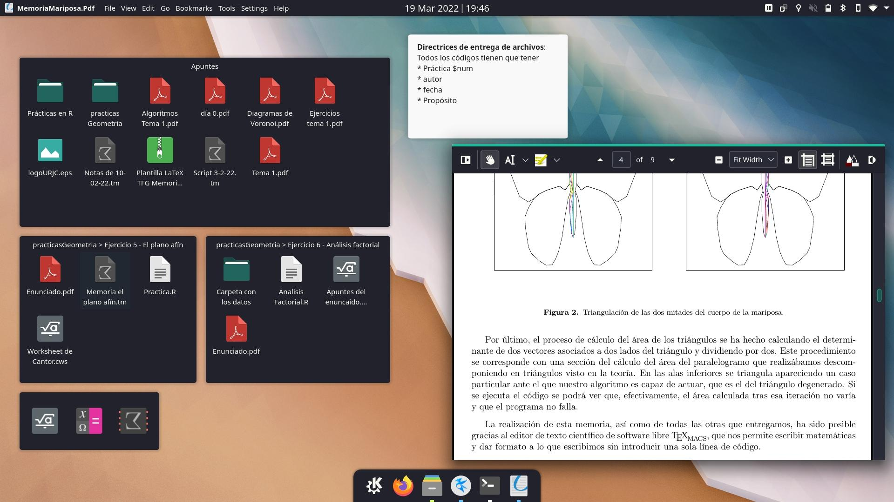
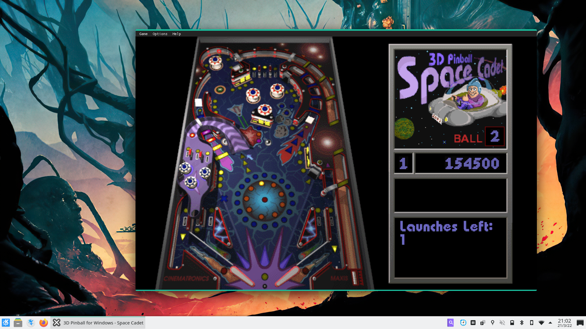
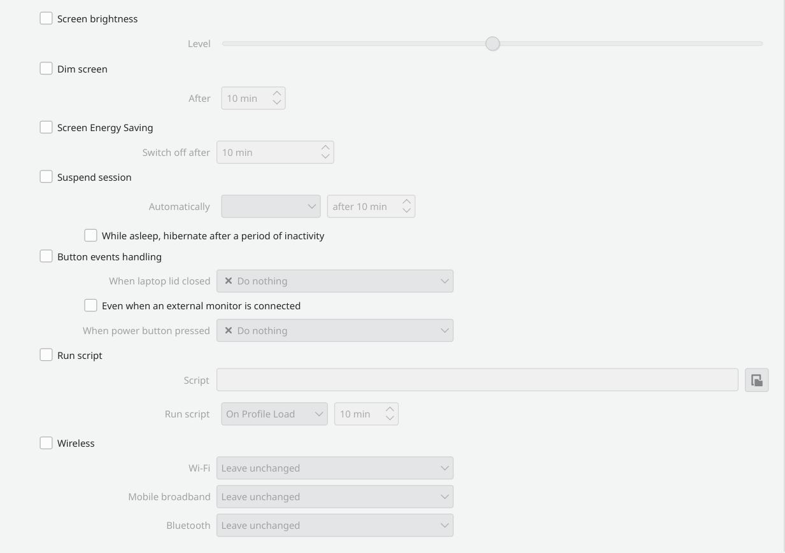
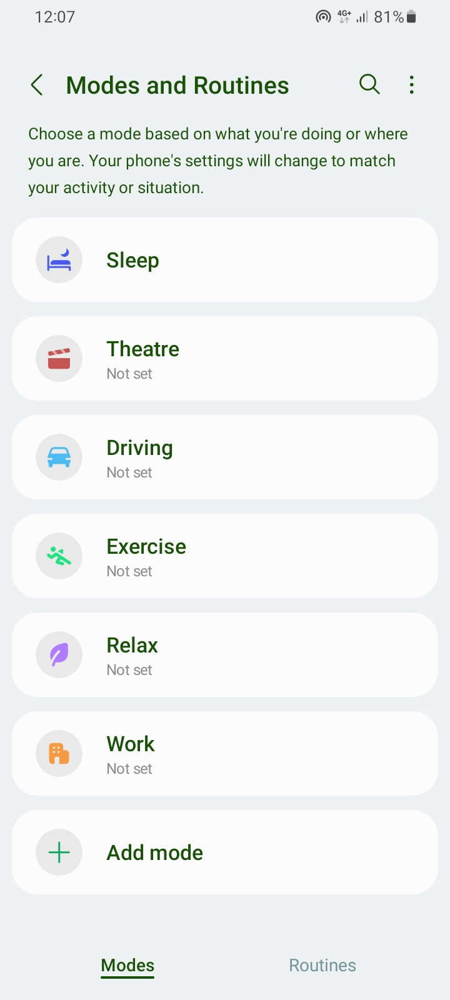

Ever since Plasma 4 came out long before I moved on to use Linux, people have been wondering what the deal with Activities were. It was only logical that, back then, people would ask about how to harness their utility. For instance, this [question](https://askubuntu.com/questions/253990/what-is-a-activity-in-kde-and-what-can-i-do-with-it) was posted on the Ask Ubuntu forums back in 2012. The problem, however, is that any cursory search yields more recent results, posted in [2019](https://www.reddit.com/r/kde/comments/dv91f4/how_do_you_use_activities/), [2021](https://www.reddit.com/r/kde/comments/psdq10/who_uses_activities_in_kde_is_it_a_helpful_feature/), 2022, [[1]](https://www.reddit.com/r/kde/comments/utdue1/do_you_use_the_activities_feature/), [[2]](https://www.reddit.com/r/kde/comments/wrpmvz/how_do_i_kde_activities_well/), and the list goes on.

I have been a KDE Plasma desktop power user almost exclusively because of this feature, going so far as to talk about them in the University I studied my double degree in Mathematics and Computer Science. Link to the presentation notes [here](https://ofilibre.gitlab.io/transpas/jornada-cultura-libre/sw/02_Iglesias.pdf). The objective of the presentation was to present different use cases that were covered by Activities without delving into the hard details, leaving them to be found by the users that wanted to try.

## What are Activities?

After taking a look at some of the use cases proposed in the linked posts, as well as some others, it doesn't seem that hard to give a succint definition:

> "Activities is a Plasma service that allows you to swap between different desktop layout, data and hardware configuration profiles."

<!-- This definition, as well as part of the following content, is drawn from some of my lengthier [previous posts](https://invent.kde.org/heqro/awesome-activities) on the KDE Forums. -->

## Customizing desktop layout and data

Activities allows the user to have different set of widgets in the desktop. It allows one to focus on the task at hand, as you only have access to the relevant bits and pieces of your data. To better illustrate this point, I tend to show some pictures like the following two:

The first picture was the desktop layout I was using to study Computational Geometry a couple years ago. I tended to keep information distributed by using the [Folder View](https://docs.kde.org/stable5/en/plasma-desktop/plasma-desktop/folder-view.html) widget. The second picture is just me playing Pinball. There are no widgets to be seen. Even the panel layout is different, just because.

Then again, this is just a showcase, but we now we know that Activities allow us to quickly change context by putting up front only the information we need at a certain moment.

### Swapping between hardware configuration profiles

#### Activities have different states

During a user session, any Activity may be stopped or be running in parallel to the one you are currently focusing.

By stopping one of your Activites, you leverage your device's memory and processor by setting your applications in a 'frozen' state. This guarantees they will be back again once you restart the Activity, but at the same time allows you to relocate those freed resources in your current Activity, or any other that is also running!

Restarting an Activity will re-open all the applications that were running and try to set them in the state they were prior to the Activity being stopped.

Stopping and restarting an Activity allows the user to only focus on their task. When an Activity is stopped, your applications will be back again once you decide to retake the task. There's no need to be micro-managing all your windows to keep your hardware resources and screen real estate in line!

Changing to an already running Activity will keep programs from both Activities running simultaneously. This responds, for instance, to the use-case of having to keep an important program running in the background that you don't want to keep track of in an unrelated Activity.

Another use-case for changing your current Activity would be that of the user that moves to an Activity dedicated exclusively to sharing your screen. This can give you an extra layer of security, knowing that nothing personal will show up and that your privacy will not be compromised. Once you stop sharing your screen, you can immediately go back to the previous Activity to keep working with its corresponding set of files and applications.

Deleting an Activity is the equivalent of removing the Plasma configuration profile linked to that Activity. Instead of closing all the applications inside the deleted Activity, it moves them to your current Activity in order to ensure your work is not lost. You may want to delete an Activity once you have passed a subject, or once you have successfully completed a project in your job.

#### Intelligent battery consumption: per-Activity Power profiles

By using the Activity Power Settings module located in the System Settings application of your Plasma 5 desktop, you can manage all of your Activities' power settings. Setting separate power configurations per Activity comes in handy when you find yourself applying the same configuration settings time and again. You may look at the following picture to get a glimpse of the per-Activity configurations available.

For instance, in an Activity dedicated to studying a course in Calculus, you may want your laptop's screen to be slightly more dimmed than usual and to make your laptop to take more time to turn its screen off. This could allow you to write down formulation for your exercises in a separate sheet of paper or to take notes in an online class while allowing your battery to last longer: you are not entirely focusing attention in your laptop during that Activity, and so you can easily adapt your Plasma desktop!

Conversely, in a programming oriented course, you may like your screen to be brighter but to make it dim as soon as you take your attention off the screen. Perhaps this course requires you to build a server application and thus you need your laptop not to sleep unless, say, you close the lid. Then again, Activities allow you to mold Plasma's energy profiles to adapt to this particular situation in an one-time configuration fashion.

### Internet and Bluetooth control

Activities allow you to take control over your Wi-fi, Mobile broadband and Bluetooth, programatically enabling and disabling them at will. This could work wonders for you if you happen to be the kind of person to get easily distracted and need to keep all kinds of distractions away, or if you happen to travel abroad and want to create an Activity to make sure you never, ever, enable your mobile data.

## Are Activities really going to disappear from Plasma 6?

After going through the previous use cases, it certainly feels like a weird decision to remove Activities. Some functionality has already been disposed of, like [per-Activity Power Settings](https://invent.kde.org/plasma/plasma-desktop/-/issues/60).

Are Activities completely leaving for Plasma 6, though? There's [ongoing discussion](https://invent.kde.org/plasma/plasma-workspace/-/issues/35). In the discussion starting post, we find some compelling reasons to do away with them:

- They are buggy
- They are not actively maintained
- Some utilities, like per-Activity application settings, are only supported by KDE Applications

These questions lead us to the final bit of the post, which is purely an opinion:

## Should Activities not be present in Plasma 6?

If they are not actively maintained, certainly. Plasma is a community effort to build a simple by default desktop, yet powerful when needed. If there is no technical interest to keep them going strong, Activities are as good as gone.

Samsung is pushing for similar utilities that they call [Modes & Routines](https://www.youtube.com/watch?v=HuayzNhE_B8). You have all these different profiles that get triggered on a certain condition (being in a certain location, driving, etcetera) and affect the behavior of your device. Perhaps Activities are the way to go, but perhaps they would fit better in Plasma Mobile?

Judging the already linked [discussion](https://invent.kde.org/plasma/plasma-workspace/-/issues/35) post, it seems like many different proposals have been pushed out to save Activities. All we've seen so far, however, are visual concepts and a lot of use cases.

If the visible faces of the many KDE projects believe that Activities are to be gone, and provided Plasma is mostly a volunteer-driven project, the right way to go (which hurts me to say as a power user) seems as clear as day.
