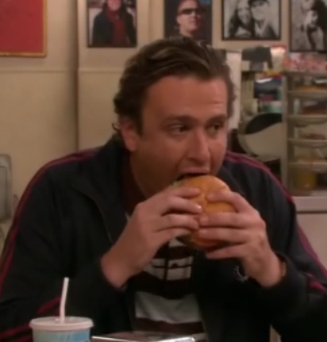

La hamburguesa tipo: pan, carne picada, lechuga, tomate, cebolla. Con algún ingrediente menos o alguno más, la estructura de uno de los platos más conocidos de la comida rápida y, cada vez más, de la no tan rápida. Si nos ponemos finos, una reinterpretación casi perversa de la experiencia rioplatense de comer una buena carne con ensalada.

Siguiendo la fórmula propuesta para la "hamburguesa tipo", contamos cinco ingredientes. Basta que uno de ellos sea menos que perfecto para que el resultado final cambie radicalmente: quizás el pan se deshace. Quizás la cebolla pica demasiado. Quizás la carne no está en el punto ideal de cocción.

Podemos acordar que el primero de los peros nos impediría a todos disfrutar la hamburguesa. Sobre los otros no hay nada escrito, ya que entran en juego variables que no conocemos, como la variedad de la cebolla o la alimentación, edad y calidad de vida de la vaca que, de forma totalmente altruista, me permite hoy decir cualquier bobada sobre este plato.

El punto que quiero reafirmar es que, si bien sobre gustos no hay nada escrito, sí es fácil evidenciar el trabajo duro, el mimo y la atención por el detalle que puede ir en una hamburguesa. Eso, a mi juicio, es parte de la experiencia de sentarse a comer en un local.

Uno de los episodios que más me llamó la atención de *Cómo Conocí a Vuestra Madre* es de los más intrascendentales para la historia, un filler. Cuenta la anécdota de cómo Marshall comió la mejor hamburguesa de su vida en un local nada memorable. Tan poco memorable era el local, que durante el capítulo entero intenta recordar dónde quedaba. ¿Realmente había existido aquella hamburguesa que quitaba el sentido? Si había existido, ¿seguía abierto ese humilde local?

El desvarío de hoy (léase: publicación) viene a raíz de un restaurante con forma de chorizo criollo: un pelín estrecho y con la cocina y el mostrador al fondo. Música country de los Estados Unidos que, asumo, venía controlada por un portátil que estaba en una de las mesas para comer. Un ventilador pequeño apunta donde se sentaría el DJ. No había nadie sentado a comer. Dudando si entrar o no, recordé que quien no arriesga no gana. Aunque yo siempre arriesgo y no gano nada, también pensé. Decidí entrar.

Lo que sucedió durante la cata de la hamburguesa (y de la siguiente que pedí) solo podría ser descrito por los mejores autores de novelas eróticas. Si algún novelista quiere colaborar conmigo, que sepa que WhatsApp no me funciona estos días, pero Bizum va bien. En definitiva: muy buenas hamburguesas ---las mejores de Guardamar---, muy buen trato, muy buen *todo*.

