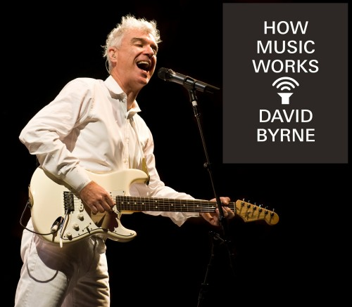
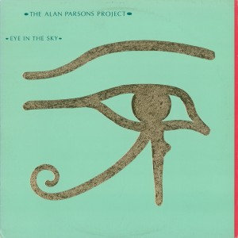

I have been reading [How Music Works](https://en.wikipedia.org/wiki/How_Music_Works) throughout last summer. It is a compendium of thoughts written by David Byrne, organized in chapters according to their common topic, about the art of making music. Such thoughts are articulated from different points of view, ranging from the one lived by Byrne himself during his stint with the Talking Heads and successive projects to purely historical, social or technical perspectives. For instance, an interesting idea is how the medium where music is interpreted [plays a key role in the resulting composition](https://www.youtube.com/watch?v=Se8kcnU-uZw).

As an example, Gregorian chant finds its ideal venue in cathedrals, where its reverberation underlines the profficiency with the voice of the interpreters. It is not hard to imagine that this would be a horrific scenario for other genres, such as highly-percussive candombe, usually played in the streets. Reciprocally, were we to shift Gregorian chant to Puerta del Sol, this genre would not only lose part of its charm, but also its wallet. The following video is a deep dive by David Byrne about some of these ideas.



> **I think that a song that lasts between three and four minutes has a natural length. It often seems to me almost inevitable.**
>
> David Byrne

This bit from the aforementioned book lies in the section titled "How long is a song?". It felt counterintuitive to me at first, because the usual argument that justifies the three-minute-song has the radio and discographic labels as its main characters.

It is common to point out to the fact that vinyl has a finite length that is marked by the very material. This severely impacts the length of an album. Some bands would play around this fact, such as the Electric Light Orchestra, that would end *Mr Blue Sky* with the phrase "Please turn me over", asking the listener to go onto the next side of the vinyl to keep listening to the rest of the album.

On the other hand, any radio station can freely choose which tracks to play to keep their audience and keep doing their thing. In this realm, a release of a new song implies that the discographic is to *suggest* the radio stations to play it. If the track was successful in radio play, this could positively affect the corrresponding single/album sales. If we consider a song like we would consider an advertising, the length of the song plays an important role in the cost of putting it in the air.

However, this is a perspective of music as a product. If we observe it as any other form of art, we should find ---either centuries ago as well as today---, multiple examples of popular songs of different length.

## [*El Cancionero de Palacio*](https://www.discogs.com/release/8668711-Hesp%C3%A8rion-XX-Jordi-Savall-El-Cancionero-De-Palacio-1474-1516), by Jordi Savall

This album is a compilation of Spanish songs written between the 15th and 16th centuries by relevant artists of the time, such as [Francisco de la Torre](https://es.wikipedia.org/wiki/Francisco_de_la_Torre_(compositor)) or [Juan del Encina](https://es.wikipedia.org/wiki/Juan_del_Encina). Released in the 90s, this album helps one come into contact with the *pop* music of back then and there, named [villancicos](https://es.wikipedia.org/wiki/Villancico).

If we take a look at the tracks length ---something we should only do in the context of statistics---, the longest track (*Harto de tanta porfía*) lasts around 7 minutes. On the other side, the shortest non-instrumental track is *Pase el agoa, ma Julieta*, lasting little more than a minute.

## A modern example, and a counterexample

Even though it is a compiliation, the songs have similar lengths to the ones that would constitute an album in the 70s, a decade when it was critical to adjust the length of a song to the shortcomings of its would-be format of distribution.

### [*Eye in the Sky*](https://www.discogs.com/master/4424-The-Alan-Parsons-Project-Eye-In-The-Sky), by Alan Parsons Project

In the case of the album that heads this section, we can easily find tracks whose lengths are similar to *El Cancionero de Palacio*'s. Take a look at the following table.

| Track | Length |
|--------------------------------------|----------|
| **Sirius (Instrumental)**                |     **1:48** |
| Eye In The Sky                       |     4:33 |
| Children Of The Moon                 |     4:49 |
| Gemini                               |     2:09 |
| **Silence And I**                        |     **7:17** |
| You're Gonna Get Your Fingers Burned |     4:19 |
| Psychobabble                         |     4:50 |
| Mammagamma (Instrumental)            |     3:34 |
| Step By Step                         |     3:52 |
| Old And Wise                         |     4:52 |

Up until now, the discussion is unhinged. I have proposed two albums whose tracks have similar length despite having been composed in dramatically different dates. One could argue that *El Cancionero de Palacio*, having been recorded in the 90s, could have the length of the songs be influenced by the know-how of the 20th century music industry. This dispute could easily be solved by examining the original sheet music, though.

### [*Supper's Ready*](https://en.wikipedia.org/wiki/Supper%27s_Ready), by Genesis

This is not an album. It is a **23** minute long song, released by a band whose members would be successful both in their solo careers as well as their stint in Genesis.

It evidently looks like the key counterexample: it is a popular song that does not fit in the three (or one, or seven) minute magic frame. How come a song like this gained such popularity?

For those that we know this track, this song is nothing but a collage of musical motifs, each of these so masterfully interwoven that it would take very profficient musicians to replicate not live, but even in the very studio. In the following table we have a distribution of each one of the constituent musical motifs of the song.

| Motif                                                                     | Length    |
|--------------------------------------------------------------------------|-------------|
| Lover's Leap                                                           |   0:00–3:47 |
| The Guaranteed Eternal Sanctuary Man                                   |   3:48–5:43 |
| Ikhnaton and Its-a-Con and Their Band of Merry Men                     |   5:44–9:42 |
| How Dare I Be So Beautiful?                                            |  9:43–11:04 |
| Willow Farm                                                            | 11:05–15:36 |
| Apocalypse in 9/8 | 15:36–20:50 |
| As Sure as Eggs is Eggs                            | 20:51–23:05 |

Each one of this motifs have been composed following this three-minute golden rule. Maybe that was the reason behind its success?

Other progressive rock formations, such as Yes or Gentle Giant, are not stranger to tracks of exotic length either. However, when we separate each of these into their "essential constituents", we will also easily start to find "sub-tracks" following this three-minute rule. Perhaps we could understand a prog rock song like the predecessor of playlists, that are now ubiquitous in music applications.

## Final thoughts

In a strict sense, an "average" song is not to last three minutes just because the discographic label or physical format forces the artist to fit it in that frame. On the contrary, we have found songs in the catalogue of Spanish popular music, both lengthier and shorter than three minutes.

Moreover, we have observed that a progressive rock song ---usually known for lasting longer than expected--- can be decomposed into sub-songs whose length will actually last around three minutes.

One could especulate that it actually is the musical motif the one that should last around 3 minutes to make up the easy-listening song. As David Byrne notes in its book, this is a length that seems to be natural to human beings.
