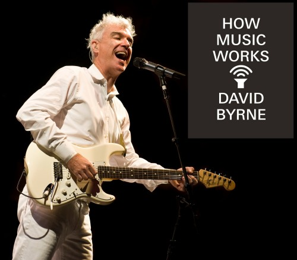
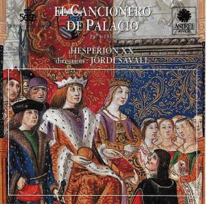
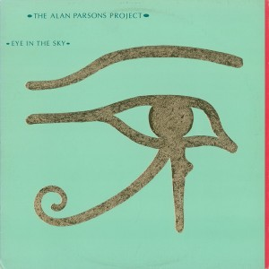
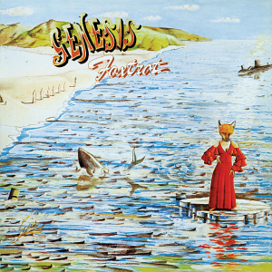

He estado leyendo [How Music Works](https://en.wikipedia.org/wiki/How_Music_Works) a lo largo del último verano. Es un compendio de reflexiones escritas por David Byrne, agrupadas en capítulos según su temática, sobre el proceso de elaboración de la música. Estos pensamientos se articulan desde diferentes puntos de vista, que van desde el vivido por él durante su etapa en Talking Heads y proyectos sucesivos hasta miradas puramente históricas, sociales o técnicas. Una idea interesante es la de cómo el medio de interpretación de la música [juega un papel clave en la composición resultante](https://www.youtube.com/watch?v=Se8kcnU-uZw).

Por ejemplo, el canto gregoriano encuentra su medio idóneo en un espacioso lugar de culto, donde la reverberación permite subrayar la maestría de la voz de sus intérpretes. No es difícil imaginar que este escenario sería terrorífico para una agrupación de música altamente percusiva como el candombe, conocido por interpretarse en las calles. Recíprocamente, si desplazamos el canto gregoriano a la Puerta del Sol, este género perdería no solo parte de su encanto, sino también su cartera. A continuación tenemos un extracto de una de las charlas que dio al respecto:



> **Me parece que una canción que dura entre tres y cuatro minutos tiene una duración natural. Me parece, en ocasiones, hasta inevitable.**
>
> David Byrne

Este comentario, lanzado casi por descuido en la sección "How long is a song?" del libro, me resultó contraintuitivo. El argumento usual para justificar los tres minutos de duración de una canción tiene como protagonistas la radio y las discográficas.

Es habitual señalar, por ejemplo, que el vinilo tiene una duración finita marcada por el material, lo que tiene un impacto en la longitud de un álbum. Algunas bandas podían llegar a jugar con este hecho, como el caso de Electric Light Orchestra, que finaliza la canción *Mr Blue Sky* con la frase "Please turn me over", solicitando al oyente que pasase a la siguiente cara del vinilo para escuchar el resto del álbum.

Por otro lado, una estación de radio puede elegir reproducir según qué temas para mantener su audiencia y justificar su existencia. El caso del lanzamiento de temas nuevos es el más claro. Una discográfica puede sugerir (pagar) a una radio la reproducción de un tema. Si el tema tiene tirón en la radio, esto podría afectar positivamente a las ventas del sencillo o del álbum correspondiente. Si consideramos una canción como podríamos considerar un anuncio, la longitud también podría haber tenido un impacto sobre el precio para poder ponerla en el aire.

Sin embargo, esta es una perspectiva de la música como producto. Si se observa como forma de arte, deberíamos encontrar ---tanto varios siglos atrás como en el presente--- múltiples ejemplos de canciones populares de distinta duración.

## [*El Cancionero de Palacio*](https://www.discogs.com/release/8668711-Hesp%C3%A8rion-XX-Jordi-Savall-El-Cancionero-De-Palacio-1474-1516), por Jordi Savall

Este álbum es una recopilación que recoge algunas canciones escritas en español entre finales de siglo XV y principios del siglo XVI por artistas de relevancia de la época, como [Francisco de la Torre](https://es.wikipedia.org/wiki/Francisco_de_la_Torre_(compositor)) o [Juan del Encina](https://es.wikipedia.org/wiki/Juan_del_Encina). Una recopilación lanzada en los años 90 que ayuda sumergirse en la música *pop* de aquella época y lugar: los [villancicos](https://es.wikipedia.org/wiki/Villancico).

Si nos atenemos a la duración de los temas ---algo que solo se debería hacer en un análisis estadístico---, el más largo (*Harto de tanta porfía*) tiene una longitud de 7 minutos. Por otra parte, la pieza no instrumental más breve es *Pase el agoa, ma Julieta*, que dura poco más de un minuto.

## Un ejemplo moderno, y un contraejemplo

Aun y siendo una recopilación, las canciones tienen duraciones similares a las que presentaban los álbumes en los 70, época en la que era crítico ajustar la duración de una pieza al formato físico en el que se distribuiría.

### [*Eye in the Sky*](https://www.discogs.com/master/4424-The-Alan-Parsons-Project-Eye-In-The-Sky), de Alan Parsons Project

En el caso del álbum que encabeza esta sección encontraríamos también piezas que se ajustan a estas duraciones máximas y mínimas. Las observamos en la tabla a continuación.

| Tema                                 | Duración |
|--------------------------------------|----------|
| **Sirius (Instrumental)**                |     **1:48** |
| Eye In The Sky                       |     4:33 |
| Children Of The Moon                 |     4:49 |
| Gemini                               |     2:09 |
| **Silence And I**                        |     **7:17** |
| You're Gonna Get Your Fingers Burned |     4:19 |
| Psychobabble                         |     4:50 |
| Mammagamma (Instrumental)            |     3:34 |
| Step By Step                         |     3:52 |
| Old And Wise                         |     4:52 |

Lo desarrollado hasta ahora suena cogido por pinzas. Lo único que se ha hecho ha sido observar que las duraciones de dos álbumes de música popular tienen una duración similar, incluso habiendo sido compuestas en fechas dramáticamente distintas.

Por ejemplo, uno podría argumentar que en El Cancionero de Palacio, al haber sido grabado en la década de los 90, podrían haberse interpretado las piezas musicales con la mentalidad y el saber hacer de finales del siglo XX. Esta disputa podría resolverse fácilmente leyendo las partituras originales, que si las hay no pude encontrar.

### [*Supper's Ready*](https://en.wikipedia.org/wiki/Supper%27s_Ready), de Genesis

Esta es, a diferencia de los dos álbumes anteriores, una canción de **23** minutos. Una canción lanzada por una banda cuyos integrantes serían exitosos tanto en sus carreras como solistas como cuando trabajaron bajo la misma marca.

A todas luces, es el contraejemplo clave: una canción popular que escapa del marco de los tres (o uno, o siete) minutos. ¿Cómo una canción de estas características puede haber ganado tanta popularidad?

Para los que conocemos este tema, esta canción es un collage de motivos musicales hilvanados con una maestría difícil de replicar, no ya en vivo, sino en el mismo estudio; en la tabla a continuación tenemos la distribución por tramos de cada uno de estos motivos musicales.

| Parte                                                                     | Duración    |
|--------------------------------------------------------------------------|-------------|
| Lover's Leap                                                           |   0:00–3:47 |
| The Guaranteed Eternal Sanctuary Man                                   |   3:48–5:43 |
| Ikhnaton and Its-a-Con and Their Band of Merry Men                     |   5:44–9:42 |
| How Dare I Be So Beautiful?                                            |  9:43–11:04 |
| Willow Farm                                                            | 11:05–15:36 |
| Apocalypse in 9/8 | 15:36–20:50 |
| As Sure as Eggs is Eggs                            | 20:51–22:54 |

Cada uno de los motivos que componen *Supper's Ready* se siguen adecuando a esta suerte de norma de oro de los 3 minutos. ¿Quizás esa es una razón detrás de su éxito?

Otras agrupaciones de rock progresivo, como Yes o Gentle Giant, no son ajenas a los temas de una longitud exótica. Sin embargo, cuando los desgranamos en cada una de sus partes esenciales, encontraremos también "sub-temas" de una duración similar a la obra de Genesis.

Una canción de rock progresivo podría ser entendida como el predecesor de las playlists que encontramos en las aplicaciones de música.

## Conclusión

En un sentido estricto, una canción "promedio" no tiene por qué durar 3 minutos porque lo dicten una discográfica o el formato físico en el que se distribuya. Al contrario, encontramos ejemplos de canciones en música popular hispana de una duración similar, quizás mayor o menor.

Asimismo, hemos observado que una canción de rock progresivo ---por lo general de una duración ampliamente mayor a la esperada--- puede ser descompuesta en sub-canciones cuya duración ronda los 3 minutos.

Podríamos especular que, en realidad, debería ser el motivo musical el que debería situarse alrededor de los 3 minutos para formar parte de una canción agradable. Como nota David Byrne en su obra, esta sería una duración que nos resulta natural a los seres humanos.
